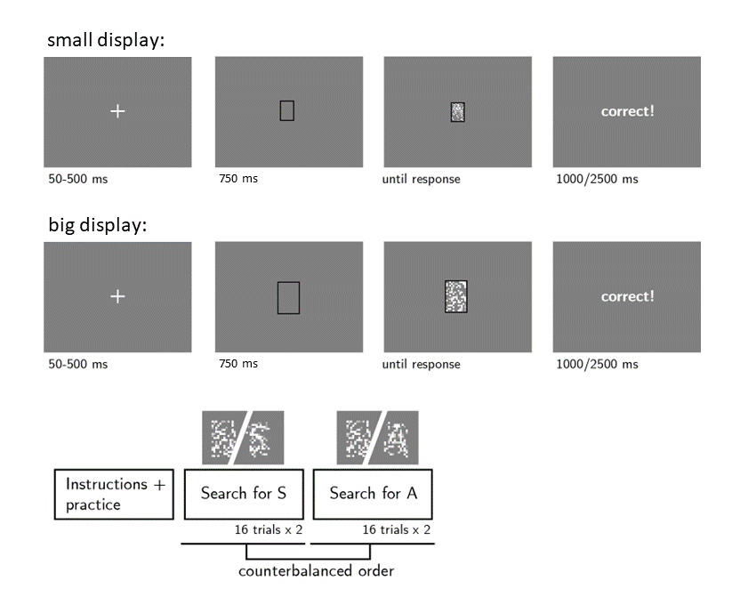

```{r setup, include = FALSE}
library('groundhog')
groundhog.library(
  c(
    'papaja', #for apa formatting
    'pwr', # for power calculation
    'tidyverse' # for pipe %>%
  ), "2024-01-01"
)
knitr::opts_chunk$set(echo=FALSE, message=FALSE, warning=FALSE, results='hide')
```

```{r analysis-preferences}
# Seed for random number generation
set.seed(42)
knitr::opts_chunk$set(cache.extra = knitr::rand_seed)
```

# Motivation

In a set of previous experiments, participants performed a letter detection task, where stimulus visibility was manipulated using either partial occlusion or embedding in a congruent versus incongruent context. While the effects of the two manipulations were qualitatively similar in target-present trials (a drop in hit rate and confidence, and an increase in reaction time), their effects in target-absent trials were different: largely mirroring the target-present effects in the case of occlusion (with the exception of reaction time effects, which were subject to population variability), but showing no effects on accuracy, confidence or reaction times in the case of context.  We interpreted these findings as revealing that the context manipulation affected visibility without affecting participants’ beliefs about visibility, but the occlusion manipulation affected both. 

In this study, we exploit potentially inaccurate beliefs people may hold about their own perception to identify a manipulation that will produce the inverse pattern: affecting beliefs about visibility more than visibility itself. Our candidate manipulation is one of stimulus size. It should be the case that as long as the stimulus size remains above a certain threshold, visibility should not be much affected. However, participants may expect that a target becomes easier to detect as stimulus size increases. And so, when no target is detected in a small display, viewers may believe that it would have been more difficult to see. Such decrease in size should therefore affect expected, but not actual visibility of the stimulus, affecting behaviour mostly in target-absent trials.

# Methods

We report how we determined our sample size, all data exclusions, all manipulations and all measures in the study. 
	
## Participants

This research complies with all relevant ethical regulations and was approved by the Medical Sciences Interdivisional Research Ethics Committee at the University of Oxford (Ethics Approval Reference R91912/RE001). Participants will be recruited via Prolific and will give informed consent prior to their participation. We will contact 250 participants who took part in a previous experiment, looking at the effects of occlusion on perceptual detection. We will stop data collection once we reach 210 included participants (after applying our pre-registered exclusion criteria), or once a week has passed from contacting the last participant (the earliest of the two). The study will take 15 minutes to complete, and participants will be paid £2.25 for their participation. This is equivalent to an hourly wage of £9.00.

## Procedure

Participants will detect the presence or absence of a target letter (S or A, in different blocks) in a patch of dynamic grayscale noise presented at 15 frames per second. In each frame, noise will be generated by randomly sampling grayscale values from a target image $I$. Specifically, for each pixel $S_{ij}$, we will display the grayscale value for the corresponding pixel in the original image $I_{ij}$ with some probability $p$, and the grayscale value of a randomly chosen pixel $I_{i\prime j\prime}$ with probability $1-p$. On target-absent trials, $p$ will be set to 0, such that the grayscale values of all pixels will be randomly shuffled. On target-present trials, $p$ will be set to 0.35. Responses will be delivered using the F and G keyboard keys, and response-mapping will be counterbalanced across subjects.
	
```{r design, echo=FALSE, fig.cap="Experimental design.Top: trial structure in the main blocks of the experiment, in trials where the stimulus is either big or small. Bottom: overall experimental structure.", out.width = '75%'}

```

After reading the instructions, participants will complete four practice trials. In case their accuracy in these four trials falls below 3/4, they will be reminded of task instructions and given additional practice trials, until they reach the desired accuracy level. Then, they will complete another four trials to practice rating their confidence by moving a dial on a vertical continuous scale, after which they will be asked a multiple-choice comprehension question. If their answer to this question is incorrect, they will be reminded of the instructions and repeat the process until they answer it correctly. Only then will they continue to the main part of the experiment. Here, their task will be exactly the same, but the noisy stimulus will be either smaller or larger (pixel size factor 3 or 5, on different trials within the same block; see Fig. 1). 
	
The main part of the experiment will comprise four blocks of 16 trials. For approximately half of the participants, in blocks 1 and 2 the target letter will be S and in blocks 3 and 4 it will be A. The order of letters will be reversed for the other half. 
	
After completing the four blocks, participants will receive a multiple-choice question: 

Sometimes the display would appear smaller, and sometimes bigger. Did you feel this had any effect on how difficult it was to spot the letter?

a)	Yes! It was harder when the display was smaller.
a)	Yes! It was harder when the display was bigger.
a)	No! The size of the display had no effect on how difficult it was to spot the letter. 

## Randomization

The order and timing of experimental events, as well as the luminance values of pixels within a trial, will be determined pseudo-randomly by the Mersenne Twister pseudorandom number generator, initialized in a way that ensures registration time-locking [@mazor_novel_2019].

## Model-fitting

We will fit a POMDP model of perceptual detection (Mazor, Moran & Press, see attached file) to the decision and decision-time data of individual subjects. 

In this model, the effects of our experimental manipulations on visibility are represented by a parameter $\alpha$, which scales the visibility of the stimulus, represented by the parameter $\theta$. Moreover, the *belief* about the effect of the manipulation is modelled as the parameter $\bar{\alpha}$, similarly scaling the believed visibility of the stimulus, $\bar{\theta}$. Fig. 2 illustrates three possible combinations of $\alpha$ and $\bar{\alpha}$, for a manipulation that affects both parameters (similar to occluding part of the display; top row), for a manipulation that affects $\alpha$ only (similar to the word-benefit effect, which may affect visibility without subjects being aware of it; middle row), and for a manipulation that affects  $\bar{\alpha}$ only (as may be the case for the size manipulation; bottom row). Specifically, to obtain model prediction for a manipulation that affects believed, but not actual visibility, we set $\alpha$ to 1 and $\bar{\alpha}$ to 0.8 for the smaller condition. Doing so results in faster reaction times for smaller stimuli in target-present decisions, but slower in target-absent decisions. The model also predicts that confidence will be lower for smaller stimuli in both target presence and target absence. Finally, both hit and false alarm rate are predicted to increase when the stimulus is smaller. 

	
```{r model_predictions, echo=FALSE, fig.cap="Model predictions for the effect of manipulations of visibility and expected visibility on reaction time, confidence and proportion of “yes” responses as a function of target presence (blue) and absence (red). Top: occlusion (affects visibility and expected visibility), middle: context (affects visibility but not expected visibility), bottom: size (affects expected visibility but not actual visibility).", out.width = '75%'}
knitr::include_graphics("figures/model_predictions.png")
```

Importantly, we present model predictions for three sets of parameters, but the actual space of parameter combinations is effectively infinite. We will therefore fit model parameters to the response and response time data of participants to determine the independent effects of stimulus size on actual versus believed visibility (see Hypotheses 11-13), leaving open the possibility that the size manipulation affect visibility, perhaps in an opposite direction to its effects on expected visibility (such that letters are, counterintuitively, easier to detect when embedded in smaller stimuli). 

## Data analysis

```{r Load and process}
# load 
df_size <- read.csv('../../experiments/pilots/pilot3/data/jatos_results_data_batch1.csv', sep = ",", header = TRUE)

# tidy 
raw_df_size <- df_size %>%
  dplyr::filter(trial_type=='noisyLetter'& (test_part=='test1' | test_part=='test2')) %>%
  dplyr::select(PROLIFIC_PID, RT, pixel_size_factor, present, correct, confidence, response, presence_key) %>%
  dplyr::rename(subj_id=PROLIFIC_PID,
                size=pixel_size_factor) %>%
  dplyr::mutate(
    RT=as.numeric(RT),
    confidence=as.numeric(confidence),
    present=as.numeric(present),
    response = response == presence_key,
    correct = ifelse(correct == 'true', TRUE, FALSE))

# exclusions
low_accuracy_size <- raw_df_size %>%
  dplyr::group_by(subj_id) %>%
  dplyr::summarise(
    accuracy = mean(correct)) %>%
  dplyr::filter(accuracy<0.5) %>%
  dplyr::pull(subj_id)

too_slow_size <- raw_df_size %>%
  dplyr::group_by(subj_id) %>%
  dplyr::summarise(
    third_quartile_RT = quantile(RT,0.75)) %>%
  dplyr::filter(third_quartile_RT>7000) %>%
  dplyr::pull(subj_id)

too_fast_size <- raw_df_size %>%
  dplyr::group_by(subj_id) %>%
  dplyr::summarise(
    first_quartile_RT = quantile(RT,0.25)) %>%
  dplyr::filter(first_quartile_RT<100) %>%
  dplyr::pull(subj_id)

to_exclude_size <- c(
  low_accuracy_size,
  too_slow_size,
  too_fast_size
) %>% unique()

task_df_size <- raw_df_size %>%
  filter(!(subj_id %in% to_exclude_size))

```

### Rejection criteria

Participants will be excluded if their accuracy falls below 50%. Participants will also be excluded if they have extremely fast or slow reaction times (below 100 milliseconds or above 7 seconds in more than 25% of the trials). Trials with reaction times below 100 milliseconds or above 7 seconds will be excluded from the reaction time analysis. 

### Hypotheses and analysis plan

This study is designed to test whether expected visibility impacts participants’ decisions about presence and absence. 

```{r H1, echo=FALSE, cache=TRUE}
response_RT <- task_df_size %>%
    dplyr::filter(RT > 100 & RT < 7000 & correct == TRUE) %>%  
    dplyr::group_by(subj_id, response) %>%
    dplyr::summarise(RT = median(RT)) %>%
    tidyr::pivot_wider(names_from = response, values_from = RT) %>%
    dplyr::mutate(response_RT = `TRUE` - `FALSE`)
t.test(response_RT$response_RT)
```

*Hypothesis 1 (PRESENCE/ABSENCE RESPONSE TIME)*: We will test the null hypothesis that response times are similar for target-present and target-absent responses, aiming to replicate the finding that decisions about the target-absence are slower than decisions about target-presence [@mazor_metacognitive_2021]. This will be tested using a paired t-test on the median individual-level reaction times from correct trials only.

```{r H2, echo=FALSE, cache=TRUE}
RT_size_present <- task_df_size %>%
    dplyr::filter(RT > 100 & RT < 7000 & present == 1 & correct == TRUE) %>%
    dplyr::group_by(subj_id, size) %>%
    dplyr::summarise(RT = median(RT))%>%
    tidyr::pivot_wider(names_from = size, values_from = RT) %>%
    dplyr::mutate(RT_size_present = `5` - `3`)
t.test(RT_size_present$RT_size_present)
```

*Hypothesis 2 (SIZE EFFECT ON REACTION TIME IN PRESENCE)*: We will test the null hypothesis that target-present response times are similar when the display is big and small. This will be tested using a paired t-test on the median individual-level reaction times from correct trials only.

```{r H3, echo=FALSE, cache=TRUE}
RT_size_absent <- task_df_size %>%
    dplyr::filter(RT > 100 & RT < 7000 & present == 0 & correct == TRUE) %>%
    dplyr::group_by(subj_id, size) %>%
    dplyr::summarise(RT = median(RT))%>%
    tidyr::pivot_wider(names_from = size, values_from = RT) %>%
    dplyr::mutate(RT_size_absent = `5` - `3`)
t.test(RT_size_absent$RT_size_absent)
```

*Hypothesis 3 (SIZE EFFECT ON REACTION TIME IN ABSENCE)*: We will test the null hypothesis that target-absent response times are similar when the display is big and small. This will be tested using a paired t-test on the median individual-level reaction times from correct trials only. 

```{r H4, echo=FALSE, cache=TRUE}
RT_size_resp <- inner_join(
  RT_size_present,
  RT_size_absent,
  by = "subj_id") %>%
  mutate(RT_size_resp = RT_size_present - RT_size_absent)
t.test(RT_size_resp$RT_size_resp)
```

*Hypothesis 4 (SIZE RESPONSE INTERACTION ON REACTION TIME)*: We will test the null hypothesis that the effect of stimulus size on reaction time is similar in target-absent and target-present responses. This will be tested using a group-level t-test on a subject-level contrast in correct trials only: $(median({RT}_{P,small})-median({RT}_{P,big}))-(median({RT}_{A,small}) - median({RT}_{A,big}))$ where P and A stand for present and absent respectively.

```{r H5, echo=FALSE, cache=TRUE}
accuracy_size <- task_df_size %>%
  dplyr::group_by(subj_id, size) %>%
  dplyr::summarise(
    hit_rate =(sum(correct & present)+0.5)/(sum(present)+1),
    fa_rate = (sum(!correct & !present)+0.5)/(sum(!present)+1),
    dprime = qnorm(hit_rate)-qnorm(fa_rate),
    criterion = -0.5*(qnorm(hit_rate)+qnorm(fa_rate)))

dprime <- accuracy_size %>%
  dplyr::select(subj_id,size,dprime) %>%
  tidyr::pivot_wider(names_from=size, values_from=dprime) %>%
  dplyr::mutate(dprime_size=`5`-`3`)
t.test(dprime$dprime_size)
```

*Hypothesis 5 (SENSITIVITY)*: We will test the null hypothesis that perceptual sensitivity (measured as $d\prime=z(H)-z(F)$) is equal as a function of the size of the stimulus. To allow the extraction of d’ for participants who committed no false-alarms or misses, we will add 0.5 to miss, hit, false-alarm and correct rejection counts [@snodgrass_pragmatics_1988]. 	

```{r H6, echo=FALSE, cache=TRUE}
criterion <- accuracy_size %>%
  dplyr::select(subj_id,size,criterion) %>%
  tidyr::pivot_wider(names_from=size, values_from=criterion) %>%
  dplyr::mutate(criterion_size=`5`-`3`)
t.test(criterion$criterion_size)
```

*Hypothesis 6 (CRITERION)*: We will test the null hypothesis that decision criterion (measured as $c=-0.5(z(H)+z(F))$) is unaffected by the size of the display. To allow the extraction of a decision criterion for participants who committed no false-alarms or misses, we will add 0.5 to miss, hit, false-alarm and correct rejection counts [@snodgrass_pragmatics_1988]. 

```{r H7, echo=FALSE, cache=TRUE}
response_confidence <- task_df_size %>%
    dplyr::filter(correct == TRUE) %>%
    dplyr::group_by(subj_id, response) %>%
    dplyr::summarise(confidence=mean(confidence)) %>%
    tidyr::pivot_wider(names_from = response, values_from = confidence) %>%
    dplyr::mutate(response_confidence = `TRUE` - `FALSE`)
t.test(response_confidence$response_confidence)
```

*Hypothesis 7 (PRESENCE/ABSENCE CONFIDENCE RATINGS)*: We will test the null hypothesis that confidence ratings are similar for target-present and target-absent responses, aiming to replicate the finding that subjective confidence levels are lower for decisions about absence than decisions about presence [@mazor_metacognitive_2021]. This will be tested using a paired t-test on the mean individual-level confidence ratings from correct trials only. 

```{r H8, echo=FALSE, cache=TRUE}
conf_size_present <- task_df_size %>%
    dplyr::filter(present == 1 & correct == TRUE) %>%
    dplyr::group_by(subj_id, size) %>%
    dplyr::summarise(confidence = mean(confidence)) %>%
    tidyr::pivot_wider(names_from = size, values_from = confidence) %>%
    dplyr::mutate(conf_size_present = `5`-`3`)
t.test(conf_size_present$conf_size_present)
```

*Hypothesis 8 (SIZE EFFECT ON CONFIDENCE IN PRESENCE)*: We will test the null hypothesis that target-present confidence ratings are similar when the stimulus is small or big. This will be tested using a paired t-test on the mean individual-level confidence ratings from correct trials only. 
		
```{r H9, echo=FALSE, cache=TRUE}
conf_size_absent <- task_df_size %>%
    dplyr::filter(present == 0 & correct == TRUE) %>%
    dplyr::group_by(subj_id, size) %>%
    dplyr::summarise(confidence = mean(confidence)) %>%
    tidyr::pivot_wider(names_from = size, values_from = confidence) %>%
    dplyr::mutate(conf_size_absent = `5`-`3`)
t.test(conf_size_absent$conf_size_absent)
```

*Hypothesis 9 (SIZE EFFECT ON CONFIDENCE IN ABSENCE)*: We will test the null hypothesis that target-absent confidence ratings are similar when the stimulus is small or big. This will be tested using a paired t-test on the mean individual-level confidence ratings from correct trials only. 

```{r H10, echo=FALSE, cache=TRUE}
conf_size_resp <- inner_join(
  conf_size_present,
  conf_size_absent,
  by = "subj_id") %>%
  dplyr::mutate(conf_size_resp = conf_size_present - conf_size_absent)
t.test(conf_size_resp$conf_size_resp)
```
		
*Hypothesis 10 (SIZE RESPONSE INTERACTION ON CONFIDENCE)*: We will test the null hypothesis that the effect of stimulus size on confidence ratings is similar in target-present and target-absent responses. This will be tested using a group-level t-test on a subject-level contrast in correct trials only: $(mean({confidence}_{P,small})-mean({confidence}_{P,big}))-(mean({confidence}_{A,small}) -mean({confidence}_{A,big}))$ where P and A stand for present and absent respectively.

```{r H11, eval=FALSE}
params_df <- occlusion_parameters %>%
  mutate(exp= 'occlusion',
         subj_id=1:n()) %>%
  rbind(size_parameters %>% 
        mutate(exp= 'size',
               subj_id=1:n())) %>%
  group_by(exp) %>%
  mutate(diff = alpha - belalpha) # no z-scoring 

t.test(log(params_df$alpha[params_df$exp == 'size']), mu=0) 
```

*Hypothesis 11 (FITTED MODEL PARAMETERS:* $\alpha$ *)*: We will test the null hypothesis that size does not affect the visibility of stimuli. This will be tested using a t-test on: $log(\alpha_{size})$ against 0.

```{r H12, eval=FALSE}
t.test(log(params_df$belalpha[params_df$exp == 'size']), mu=0) 
```


*Hypothesis 12 (FITTED MODEL PARAMETERS:* $\bar{\alpha}$*)*: We will test the null hypothesis that size is not believed by subjects to affect the visibility of stimuli. This will be tested using a t-test on: $log({\bar{\alpha}}_{size})$ against 0.

```{r H13, eval=FALSE}
t.test(params_df$diff[params_df$exp == 'occlusion'], params_df$diff[params_df$exp == 'size'], paired = TRUE) # paired t-test
```

*Hypothesis 13 (FITTED MODEL PARAMETERS)*: We will test the null hypothesis that the relationship between model parameters representing the actual and believed effects of the experimental manipulation on visibility is similar for the occlusion and size manipulations. This will be tested using a paired t-test on the following contrast:  $(\alpha_{occlusion}-{\bar{\alpha}}_{occlusion})-(\alpha_{size}-{\bar{\alpha}}_{size})$.
	
### Sample size justification

In Experiment 2 of [@mazor_role_2024], the standardised effect size for Hypothesis 2 (interaction between occlusion and target presence with respect to reaction times) was 0.25. Since our focus is on the corresponding effect of stimulus size, we decided to test enough participants to obtain sufficient statistical power to detect an effect of 0.25 standard deviations. With 210 participants, we will have a statistical power of `r pwr.t.test(n=210,d=0.25,type="paired")$power%>%printnum()` to detect effect sizes of 0.25 standard deviations. 

\newpage

## References
